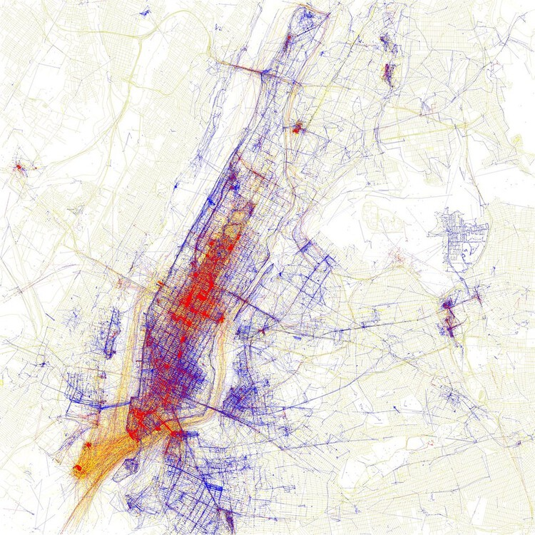

## 👋🏽 Hi! I am Maria Paoli, based at Buenos Aires argentine-italian 🇦🇷🇮🇹 in the challenge of becoming a Data Science and Data analysis professional 👩🏻‍🚀 

## My journey so far 
I have a degree in Economics, +9 years experience as Development and Fundraising Leader in different organization and projets. Three years as Chief Development Officer at the Ministry of Culture of the City of Buenos Aires, Museo Moderno de Buenos Aires -working with organizations, leads as sponsors companies, major donors and allies worldwide programs, fundraising strategies, CRM, governmental performance reports for my area and teams, etc.-.
I also have +7 years experience as Production Team leadership at Advertising Film industry for major brands and companies -working with local and international production houses and directors-.
  
## My language  
Epanish 🇪🇸 English 🇬🇧 Italian 🇮🇹 

## 🌐🛰💎 Looking to collaborate with innovative and ambitious teams at:  
    - Business Inteligence
    - Industrial and production productivity
    - Investments, capital markets and ETFs
    - Users/costumers products
    - Global econonomy, clusters and economic sectors analysis and projections 
    - Smart Cities and Smart Governance models
    - Public Policies
    - Social and world population data analysis
## You can reach me at

* mariapaoli at gmail
* My [Linkedin](https://www.linkedin.com/in/mariapaoli)
